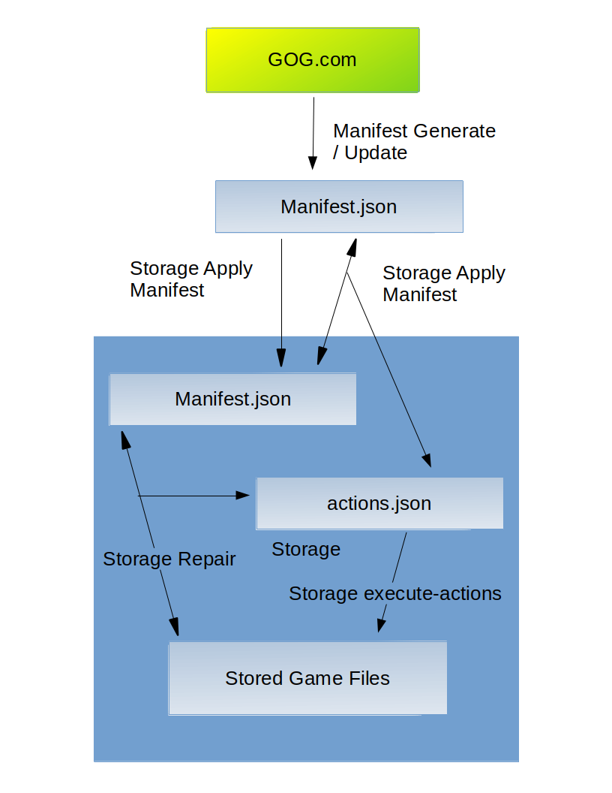

# Achitecture Documentation

This documentation is an architectural overview of how the tool operates.

# Goal of the Tool

The tool is meant to maintain a store of games purchased on GOG.com which is essentially a mirror of your game collection on the website.

There is some filtering support so that only the part of your collection that you want (ex: you can filter out MacOS or Italian installers) is mirrored.

# Concepts the Tool Uses

Conceptually, the tool uses the following components:

- **GOG.com**: The GOG website, where you purchase and download games
- **Storages**: A persistent store that will mirror either your entire GOG collection or a subset of it. It also stores some metadata files (the manifest and actions files) for efficiency's sake.
- **Manifest**: This is a file that describes either an existing or desired state for a collection of game files in your storage. It lists games and game files.
- **Actions**: This is a file that represents every atomic action the client will have to do in order to bridge the difference between what is described in a manifest file and the actual game files stored in your storage. After every action in the actions file is executed, the manifest will perfectly represent the state of the game files in your storage.
- **Updates**: This is a file that lists all the games that GOG.com marks as new or updated at a given point in time.

# Command Flow

The diagram below shows how the various commands affect the above components:

The **gogcli manifest generate** will generate a fresh **manifest** from **GOG.com**. **gogcli manifest update** will update specific games in the **manifest** (either specified by game **id** or via an **updates** file generated based on what **GOG.com** flaged as new or updated in your collection) based on **GOG.com**.

The **gogcli storage apply** command will move a **manifest** file to your **storage**, generate an **actions** file in your storage based on the different between the **manifest** you just applied and the previous manifest. It will then proceed to run the **actions** specified on the **actions** file on your **storage**.

In the event that a **gogcli storage apply** command does not run to completion, **gogcli storage resume** will run any lingering **actions** in your storage.

If there is a pre-existing **actions** file in your storage and you wish to update the **manifest** in your storage and adjust the **actions** accordingly, **gogcli storage update-actions** will allow you to do that (**gogcli storage apply** only works if there are no lingering actions in your storage).

And should the **game files** in your **storage** become out of sync with your **manifest** by accident (file corruption, file deletion, etc), **gogcli storage repair** will generate a new **actions** file in your storage, based on the observed different between the **manifest** and the **game files** in your **storage** (the **manifest** is considered authoritative).

